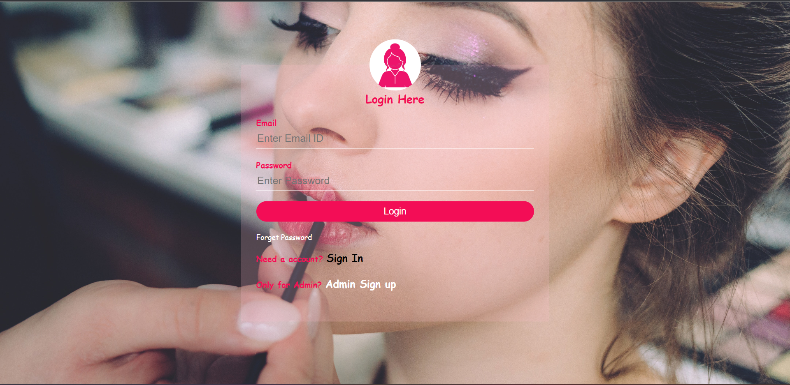
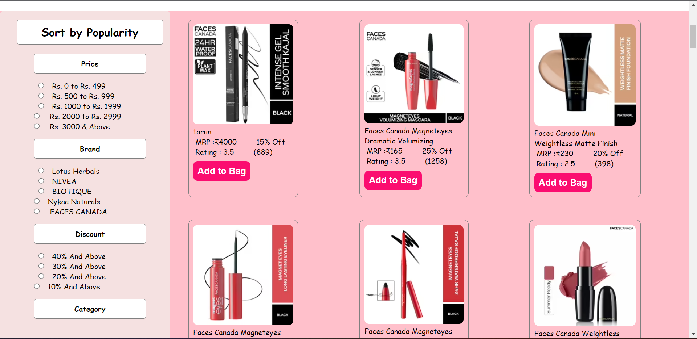
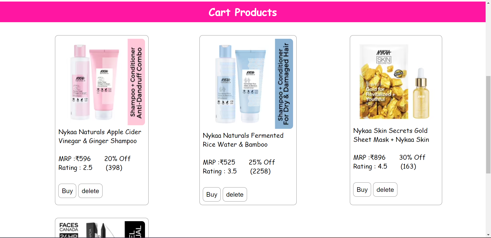
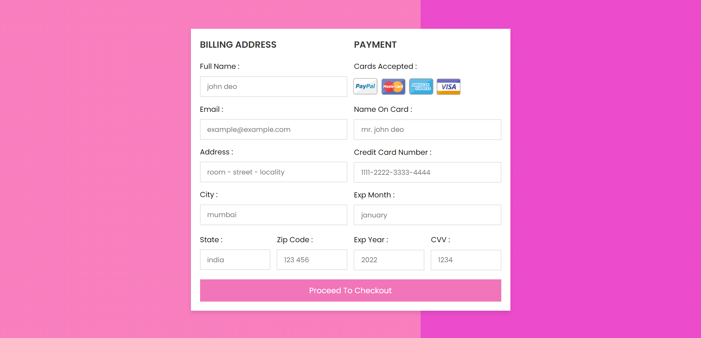

# Lykaa [Clone Of Nykaa]

#Logo 
<br><br>


<br>
<h3>Welcome to the Nykaa Website! This website is an online beauty and wellness destination that offers a wide range of products, including makeup, skincare, haircare, fragrances, and more.</h3>
<br>

<h2>Getting Started<h2>
  <h3>
To get started with the Nykaa website, you can simply visit our website at www.nykaa.com. Once you are on the website, you can browse through our extensive collection of products and add the ones you like to your cart.

To make a purchase, you will need to create an account on our website. You can do this by clicking on the "Sign Up" button on the top right-hand corner of the website. Once you have created an account, you can add your address and payment details to complete your purchase. </h3>
  
  <br><br>
  
  
  <h2>Features</h2>
<h4>The Nykaa website offers a number of features to make your shopping experience as smooth and enjoyable as possible. Some of these features include:
<br><br>
<i>Product Categories </i> : We have organized our products into various categories to make it easier for you to find what you are looking for. You can browse through categories such as Makeup, Skincare, Haircare, Fragrances, and more. <br><br>

<i>Search Functionality</i> : If you are looking for a specific product, you can use our search bar to find it quickly and easily. <br>
<i>Cart Functionality </i> : Add the item in a cart. <br><br>

<i>Easy Checkout</i> : Our checkout process is quick and easy, and we accept a variety of payment methods, including credit and debit cards, net banking, UPI, and more. <br><br>

  <br><br>
<h3>It is a indivisual project I complete the project a span of 5 day I implemnet lots of features in this website due to time issue I am not able to implement some features</h3>
<br><br>  

</h4>


## Demo

[Lykaa](https://glistening-croissant-1be435.netlify.app/login.html)


## Authors


- [Tarun Kumar](https://github.com/IAmtarunKumar)


## Backend Deployment


To deploy this project run following commands on Backend folder

```bash
  npm install
```

```bash
  npm run server
```


## Environment Variables

To run this project, you will need to add the following environment variables to your .env file

`mongoURL`

`port`

  
    <h1>Home Page </h1>

  
   <h1>Sign Up Page </h1>

  
      <h1>Login Page </h1>

  
  
       <h1>Product Page</h1>

  
      <h1>Cart Page </h1>

  
  <h1>Payment Page </h1>



